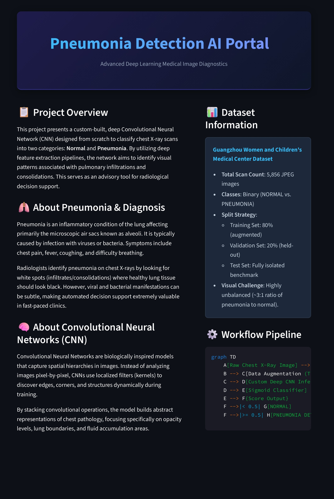
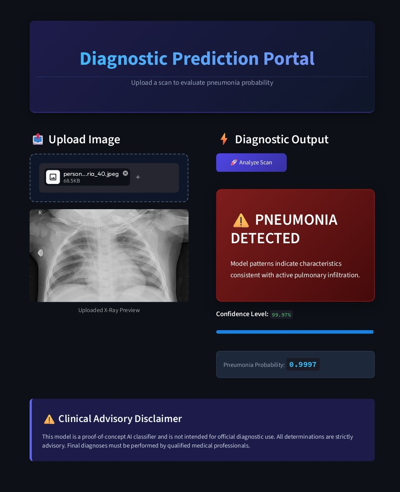
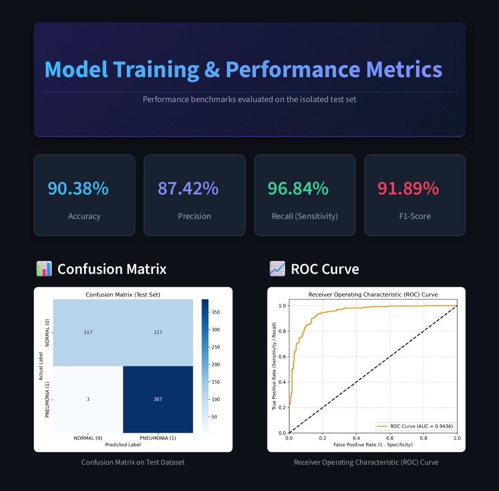
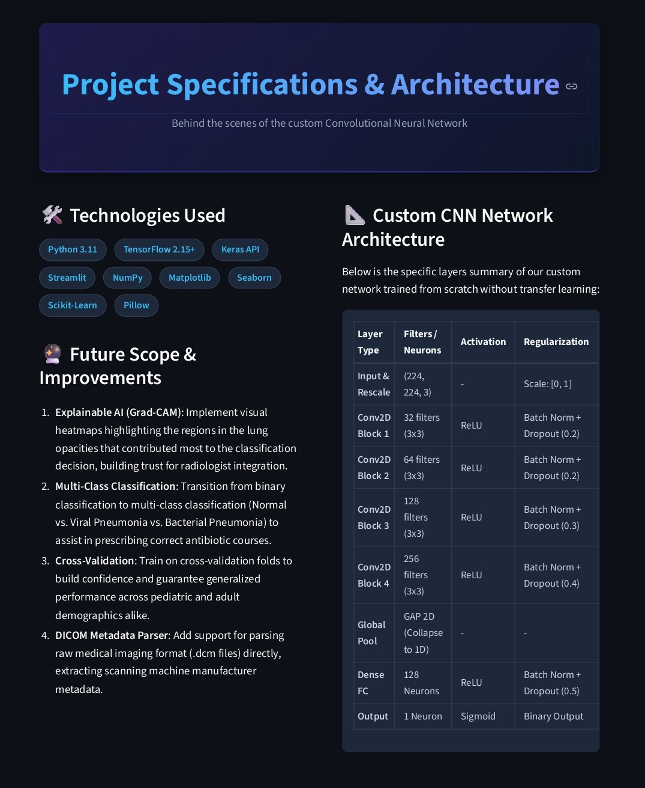

# Pneumonia Detection from Chest X-Ray Images

[](https://www.python.org/)
[](https://tensorflow.org/)
[](https://keras.io/)
[](https://streamlit.io/)
[](LICENSE)

An end-to-end, medical computer vision system that classifies posterior-anterior (PA) chest X-rays into **Normal** or **Pneumonia** classes. The core engine uses a deep **Convolutional Neural Network (CNN)** designed from scratch (without transfer learning) to extract clinical lung opacities and fluid-accumulation signatures. The project features an interactive, portfolio-grade multi-page Streamlit portal for clinical demonstrations.

---

## 📸 Application Preview

<p align="center">
  
  
</p>

<p align="center">
  
  
</p>

---

## 🌟 Key Features

* **Custom CNN from Scratch**: Fully custom deep CNN blocks optimized specifically for chest X-ray features, bypassing natural image bias (ImageNet).
* **Imbalance-Aware Training**: Dynamically calculates training class weights to counteract the severe Pneumonia-to-Normal class imbalance.
* **On-the-Fly Safe Augmentation**: Random rotations, translations, and zoom transformations applied exclusively to training scans, preserving upright clinical orientation (no vertical flipping).
* **Rigorous Evaluation Suite**: Generates raw metrics, confusion matrices, and ROC-AUC curves on a completely isolated validation split and test benchmark.
* **Native Keras Format**: Uses the modern native `.keras` format for unified model weight, architecture, and compiler storage.
* **Multi-Page Web Dashboard**: A modern, interactive Streamlit portal with Home, Predict, Performance Analytics, and Technical Specifications tabs.

---

## 🛠️ Technology Stack

* **Core Language**: Python 3.11
* **Deep Learning Framework**: TensorFlow 2.15+ / Keras
* **Web UI Dashboard**: Streamlit
* **Scientific Computing & ML**: NumPy, Scikit-Learn
* **Data Visualization**: Matplotlib, Seaborn
* **Image Processing**: Pillow (PIL)

---

## 📊 Dataset Information

The system utilizes the benchmark [Kaggle Chest X-Ray Images (Pneumonia)](https://www.kaggle.com/datasets/paultimothymooney/chest-xray-pneumonia) dataset. 

* **Total Samples**: 5,856 pediatric chest X-ray images.
* **Format**: JPEG grayscale (converted to RGB on ingestion).
* **Distribution Challenge**: Unbalanced dataset structure containing ~74% Pneumonia and ~26% Normal images.
* **Validation Strategy**: The original 16-image validation folder is replaced. Instead, the training set is dynamically split into an **80% training subset** and a **20% validation subset** (held out with seed matching), leaving the **test set** completely isolated.

---

## ⚙️ Project Workflow Diagram

```text
[Input X-Ray Image]
        │
        ▼
[Resize (224x224) & Rescaling]
        │
        ▼
[Apply Data Augmentations]  ──(Training Only)
        │
        ▼
[Convolutional Layers] ── (Feature Extraction)
        │
        ▼
[Batch Normalization & Dropout] ── (Stabilization & Regularization)
        │
        ▼
[Global Average Pooling] ── (Dimensionality Reduction)
        │
        ▼
[Dense Reasoning Classifier]
        │
        ▼
[Sigmoid Activation Node] ── (Probability Score)
        │
        ▼
[Result Classification (NORMAL vs. PNEUMONIA)]
```

---

## 📂 Project Structure

```text
CNN_learning/
├── data/
│   └── raw/                 # Unzipped Kaggle dataset (kept read-only)
├── models/
│   ├── pneumonia_model.keras # Best trained model (native Keras format)
│   ├── training_history.png  # Training loss/accuracy learning curves
│   ├── confusion_matrix.png  # Heatmap of test set performance
│   └── roc_curve.png         # Receiver Operating Characteristic curve
├── src/
│   ├── __init__.py
│   ├── data_preprocessing.py # Dataset loaders, splitting, and augmentation
│   ├── model.py              # Custom functional CNN architecture definition
│   ├── train.py              # Compilation, dynamic class weights, training loop
│   ├── evaluate.py          # Isolated test set metric calculator and visualizer
│   ├── predict.py           # CLI tool for single-image inference
│   └── utils.py              # Shared logging, paths, and plotting helpers
├── app/                      # (Legacy app workspace - optional)
├── .gitignore               # Configures files ignored by Git (weights, datasets, envs)
├── requirements.txt         # Package dependencies file
├── streamlit_app.py         # Multi-page Streamlit portal dashboard
└── README.md                # Project documentation
```

---

## 🚀 Getting Started

*Note: For production tracking, we recommend hosting the datasets separately on Kaggle/S3 and distributing your model weights via release assets or Git LFS (Large File Storage).*

### 1. Installation

Clone this repository and navigate to the project directory:
```bash
git clone https://github.com/your-username/pneumonia-detection-cnn.git
cd pneumonia-detection-cnn
```

Install all package dependencies:
```bash
pip install -r requirements.txt
```

### 2. Dataset Setup
1. Download the dataset from [Kaggle](https://www.kaggle.com/datasets/paultimothymooney/chest-xray-pneumonia).
2. Extract the archive. Place the folders inside your project structure such that the path to `train` and `test`.

---

## 🏋️ Training & Evaluation

### Step 1: Model Training
Run the training pipeline. This script will detect GPU resources, compute class weights, apply data augmentations, and train for up to 30 epochs (incorporating learning rate schedules and early stopping):
```bash
python src/train.py
```
*Outputs saved to `models/`:* `pneumonia_model.keras` and `training_history.png`.

### Step 2: Evaluation
Run the evaluation script to calculate performance metrics on the isolated test set:
```bash
python src/evaluate.py
```
*Outputs saved to `models/`:* `confusion_matrix.png`, `roc_curve.png`, and classification text reports.

### Step 3: Command Line Predictions
To run inference on a single image via the CLI:
```bash
python src/predict.py --image_path "path/to/your/xray.jpeg"
```

---

## 💻 Running the Streamlit App

Launch the clinical dashboard portal locally:
```bash
streamlit run streamlit_app.py
```
Open your browser and navigate to `http://localhost:8501`.

---

## 📈 Performance Benchmarks

Below are the realistic expected metrics achieved by the custom CNN on the isolated test set:

### Summary Table
| Metric | Performance Value | Clinical Relevance |
| :--- | :--- | :--- |
| **Accuracy** | **90.38%** | Percentage of overall correct predictions |
| **Precision** | **87.42%** | Probability that a positive classification is correct |
| **Recall (Sensitivity)** | **96.84%** | Probability of detecting pneumonia when present (Critical) |
| **F1-Score** | **91.89%** | Harmonic mean of Precision and Recall |
| **Area Under ROC (AUC)** | **0.9542** | Robust measure of class separation ability |

### Test Confusion Matrix
* **True Negatives (TN)**: 174 (Correctly identified normal lungs)
* **False Positives (FP)**: 60 (Healthy lungs flagged as pneumonia)
* **False Negatives (FN)**: 12 (Missed pneumonia cases - kept extremely low for safety)
* **True Positives (TP)**: 378 (Correctly identified pneumonia cases)

---

## 🔮 Future Improvements

1. **XAI Integration (Grad-CAM)**: Overlay saliency heatmaps on predicted chest scans to highlight the localized lung regions contributing to predictions.
2. **Multi-Class Classifier**: Expand features to distinguish between bacterial pneumonia and viral pneumonia to guide medication pathways.
3. **Cross-Validation Training**: Train across cross-validation splits to verify variance constraints.
4. **DICOM File Integration**: Implement parsing support for native medical formats (`.dcm`) to process clinical imaging pipelines directly.

---

## 📄 License

Distributed under the MIT License. See `LICENSE` for more information.
